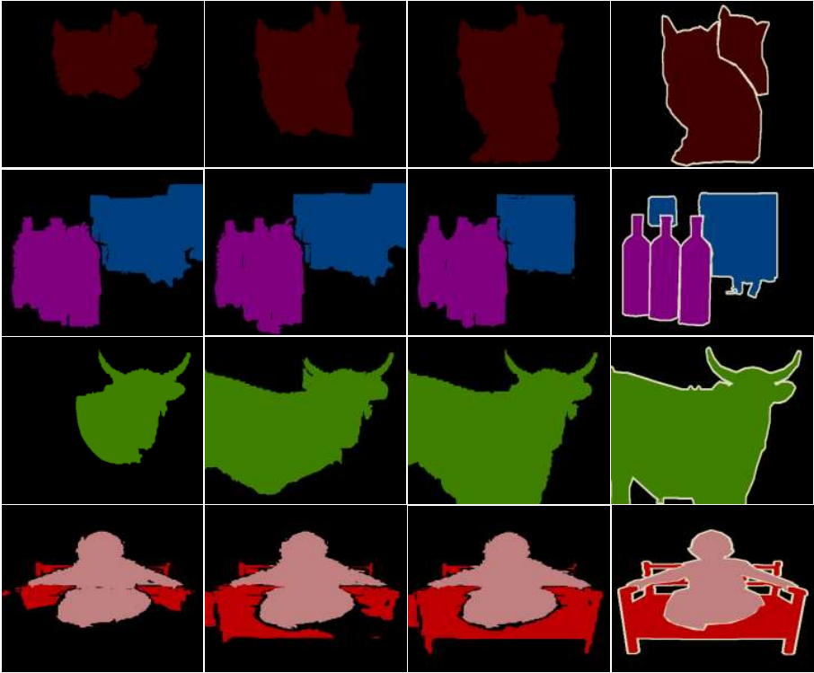

# Weakly Supervised Semantic Segmentation via Saliency Perception with Uncertainty-guided Noise Suppression
<p align="center"></p>

## Requirement
Use the following command to prepare your enviroment.
```
pip install -r requirements.txt
```
### Dataset
* Follow instructions in http://host.robots.ox.ac.uk/pascal/VOC/voc2012/#devkit and https://cocodataset.org/#download

## Execution
```
python run_sample.py
```
* You can either mannually edit the file, or specify commandline arguments.

## Acknowledgement
This code is highly borrowed from [IRN](https://github.com/jiwoon-ahn/irn). Thanks to Jiwoon, Ahn.

## Citation
If you find this work useful for your research, please cite our paper:
```
@article{liu2024weakly,
  title={Weakly supervised semantic segmentation via saliency perception with uncertainty-guided noise suppression},
  author={Liu, Xinyi and Huang, Guoheng and Yuan, Xiaochen and Zheng, Zewen and Zhong, Guo and Chen, Xuhang and Pun, Chi-Man},
  journal={The Visual Computer},
  year={2024},
  publisher={Springer}
}
```